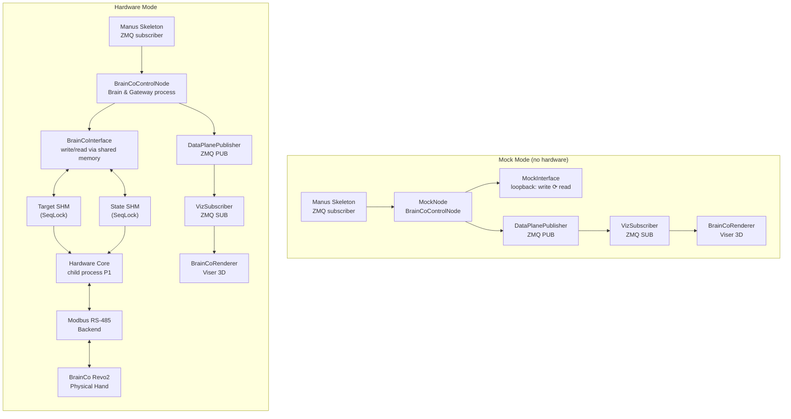

# From Mock/Viz to Real Hardware — BrainCo Revo2 Tutorial

This tutorial walks you through the full progression: **mock-only simulation → 3D visualization (viz) → real hardware control**.

---

## Table of Contents

1. [Architecture Overview](#1-architecture-overview)
2. [Prerequisites & Installation](#2-prerequisites--installation)
3. [Step 1: Mock Mode (No Hardware)](#3-step-1-mock-mode-no-hardware)
4. [Step 2: Add 3D Visualization](#4-step-2-add-3d-visualization-viz)
5. [Step 3: Device Configuration](#5-step-3-device-configuration)
6. [Step 4: Probe & Verify Hardware](#6-step-4-probe--verify-hardware)
7. [Step 5: Run with Real Hardware](#7-step-5-run-with-real-hardware)
8. [Step 6: Joint-Level Testing](#8-step-6-joint-level-testing)
9. [Troubleshooting](#9-troubleshooting)

---

## 1. Architecture Overview



**Key insight:** The `BrainCoControlNode` always calls `interface.write()` / `interface.read()`. The _only_ difference is which `RobotInterface` implementation backs those calls:

| Mode     | Class              | `write()` →                                                 | `read()` ←                                |
| -------- | ------------------ | ----------------------------------------------------------- | ----------------------------------------- |
| **mock** | `MockInterface`    | Stored in-process                                           | Returns last `write()`                    |
| **hw**   | `BrainCoInterface` | Shared memory → Hardware Core child process → Modbus RS-485 | Shared memory ← Hardware Core ← telemetry |

The viz (`BrainCoRenderer` + `VizSubscriber`) is **always** a separate process subscribing to the node's ZMQ data plane — it works identically in both modes.

---

## 2. Prerequisites & Installation

### 2.1 Install the package

```bash
# Clone and enter the repo
cd ts-dexim-brainco

# Install dev dependencies (Python, pinocchio, etc.)
pixi install

# Verify: mock tests should all pass
pixi run test
```

### 2.2 Install optional dependencies

```bash
# For visualization (Viser + pinocchio)
pixi run pip install 'dexim-brainco[viz]'

# For real hardware (BrainCo SDK)
pixi run pip install 'dexim-brainco[hardware]'

# Or install everything at once
pixi run pip install 'dexim-brainco[all]'
```

### 2.3 Hardware prerequisites (for Step 5+)

- **BrainCo Revo2 hand** connected via RS-485 / Modbus (USB-to-RS485 adapter)
- **bc-stark-sdk** installed (see above)
- External power supply connected to the hand
- Know your COM port (e.g., `COM5` on Windows, `/dev/ttyUSB0` on Linux)

---

## 3. Step 1: Mock Mode (No Hardware)

Mock mode is a **fully in-process simulation**. `MockInterface` stores commanded positions and returns them on the next `read()` — no hardware, no shared memory, no child processes.

### 3.1 Start the node in mock mode

```bash
dexim-brainco run --mode mock --hand left
```

Expected output:

```
Starting BrainCo node in mock mode...
  Hand:    left
  Address: tcp://localhost:5555
* BrainCo node is running. Press Ctrl+C to stop.
```

### 3.2 What's happening

1. A `BrainCoControlNode` is created with a `MockInterface` (6 joints).
2. It subscribes to Manus skeleton data on `tcp://localhost:5555`.
3. On each tick: receive skeleton → extract finger vectors → retarget to joint angles → filter → send to `MockInterface.write()`.
4. `MockInterface.write()` stores the command; `MockInterface.read()` returns it back.
5. Press **Ctrl+C** to stop.

### 3.3 Test with simulated skeleton data

If you don't have a Manus glove, you can still verify the pipeline by sending hand-state messages programmatically. See `tests/mock/test_node_pipeline.py` for examples of how to inject `HandState` messages.

### 3.4 What you can validate in mock mode

- ✅ Pipeline logic (extraction, retargeting, filtering)
- ✅ Configuration loading
- ✅ Node lifecycle (start/pause/stop/shutdown)
- ✅ ZMQ publishing (no actual subscribers needed)

---

## 4. Step 2: Add 3D Visualization (Viz)

The visualization is **completely independent** of the control node. You can start and stop it freely without affecting the control loop.

### 4.1 Start the visualizer

In a **separate terminal**:

```bash
dexim-brainco viz --hand left --port 8080
```

This starts:

1. A **Viser** web server on `http://localhost:8080`
2. A **VizSubscriber** that connects to the node's ZMQ data plane (`tcp://localhost:5556`) and subscribes to `action/brainco_left/joint_cmd`

### 4.2 Open the 3D view

Open your browser and navigate to **http://localhost:8080**.

You should see:

- The Revo2 hand mesh in its default pose
- Joints animate in real-time as the node publishes action messages
- End-effector spheres at each fingertip

### 4.3 Run both together

Terminal 1 (node):

```bash
dexim-brainco run --mode mock --hand left
```

Terminal 2 (viz):

```bash
dexim-brainco viz --hand left --port 8080
```

Now open http://localhost:8080 in your browser. When skeleton data flows through the node, you'll see the hand animate.

### 4.4 Programmatic viz (in Python)

```python
from dexim.brainco.model import create_model
from dexim.brainco.viz import BrainCoRenderer, VizSubscriber

# Create the kinematic model (requires pinocchio + URDF)
model = create_model(hand_side="left")

# Start the renderer (Viser server)
renderer = BrainCoRenderer(model=model, port=8080)

# Subscribe to node's data plane and drive the renderer
viewer = VizSubscriber(
    renderer=renderer,
    endpoint="tcp://localhost:5556",
    node_id="brainco_left",
    fps=60.0,
)
viewer.run()  # blocks until Ctrl-C
```

### 4.5 What you can validate with viz

- ✅ Kinematic model loads correctly
- ✅ Joint angles produce natural-looking hand poses
- ✅ The retargeting pipeline produces reasonable finger configurations
- ✅ End-effector positions match expectations

---

## 5. Step 3: Device Configuration

Before connecting real hardware, set up a named configuration and device alias. This avoids typing `--port COM5 --baud 460800 --hand left` every time.

### 5.1 Create a named config

```bash
dexim-brainco config new lab-revo2 --hand left
```

This opens your editor with a template YAML. Edit it to match your hardware:

```yaml
interface:
  mode: hw
  hw:
    backend: modbus_rs485
    rs485:
      port: COM5 # ← set your COM port
      baud: 460800
    slave_id: 126 # 126 = left hand, 127 = right hand
    auto_detect: false # set true to auto-detect the device
    auto_calibrate: false # set true for auto zero-point calibration
    hardware_core:
      rate_hz: 30.0
      shm_prefix: brainco
      carrot_lookahead_cycles: 0.0

brainco:
  side: left
```

### 5.2 List configs

```bash
dexim-brainco config list
```

### 5.3 Register a device alias

```bash
dexim-brainco devices add left_revo2 --config lab-revo2
```

### 5.4 List devices

```bash
dexim-brainco devices list
```

Expected output:

```
Registered Devices
┌──────────────┬─────────────────┬─────────────┐
│ Name         │ Package         │ Config      │
├──────────────┼─────────────────┼─────────────┤
│ left_revo2   │ dexim-brainco   │ lab-revo2   │
└──────────────┴─────────────────┴─────────────┘
```

### 5.5 Where configs live

| File           | Location                | Purpose                                |
| -------------- | ----------------------- | -------------------------------------- |
| `devices.yaml` | `config/dexim/`         | Device name → package + config mapping |
| `<name>.yaml`  | `config/dexim/brainco/` | Per-device BrainCoNodeConfig           |

---

## 6. Step 4: Probe & Verify Hardware

Before running the full control node, verify that your hand is detected and reachable.

### 6.1 Scan serial ports

```bash
dexim-brainco devices scan
```

This lists all available serial ports. Confirm your RS-485 adapter appears.

### 6.2 Probe the hand

```bash
dexim-brainco probe --port COM5
```

This attempts basic detection (ping / device info query) via the SDK.

### 6.3 Full connectivity check

```bash
dexim-brainco check --port COM5
```

A deeper check that may include motor status readback.

### 6.4 Using the device alias

If you registered a device in Step 5:

```bash
dexim-brainco probe --device left_revo2
dexim-brainco check --device left_revo2
```

### 6.5 What these commands validate

| Command        | Checks                                  |
| -------------- | --------------------------------------- |
| `devices scan` | Serial port exists, OS can see it       |
| `probe`        | SDK can detect/talk to the device       |
| `check`        | Motors respond, telemetry is consistent |

> **⚠️ Safety:** The hand will **not move** during probe/check — these are read-only diagnostics.

---

## 7. Step 5: Run with Real Hardware

Once probe/check both pass, you're ready for full teleoperation.

### 7.1 Start the node (CLI flags)

```bash
dexim-brainco run --mode hw --port COM5 --baud 460800 --hand left
```

Or using your device alias:

```bash
dexim-brainco run --device left_revo2
```

### 7.2 What changes under the hood

When the node calls `interface.connect()`:

1. `BrainCoInterface` creates two shared-memory blocks: **Target** (commands) and **State** (telemetry).
2. It spawns a **Hardware Core** child process (P1).
3. Inside P1, the Modbus RS-485 backend initializes, connects to the hand, and enters a tight 30 Hz control loop.
4. The main process (Brain & Gateway) never touches hardware directly — it only reads/writes shared memory.

```
Brain/Gateway process
  → BrainCoInterface.write(cmd)    # microseconds, shared memory
    → Target SHM
      → Hardware Core P1 reads Target SHM
        → Modbus RS-485 backend.send(cmd)
          → Physical hand moves
        → Modbus RS-485 backend.recv() → telemetry
      → Hardware Core P1 writes State SHM
  ← BrainCoInterface.read()         # microseconds, shared memory
    ← State SHM
```

### 7.3 Add visualization

Terminal 1:

```bash
dexim-brainco run --device left_revo2
```

Terminal 2:

```bash
dexim-brainco viz --hand left --port 8080
```

The visualizer now shows the **real** joint angles reported by the hardware.

### 7.4 Auto-start teleoperation

By default, the node waits for an orchestrator `START` command. To activate immediately:

```bash
dexim-brainco run --device left_revo2 --auto-start
```

---

## 8. Step 6: Joint-Level Testing

For direct hardware commands without the full node pipeline:

### 8.1 Open hand fully

```bash
dexim-brainco joint open --port COM5
```

### 8.2 Close hand fully

```bash
dexim-brainco joint close --port COM5
```

### 8.3 Watch telemetry

```bash
dexim-brainco joint watch --port COM5
```

Streams live joint positions, velocities, and torques to the terminal.

### 8.4 Using device alias

```bash
dexim-brainco joint open --device left_revo2
dexim-brainco joint close --device left_revo2
dexim-brainco joint watch --device left_revo2
```

### 8.5 What to look for in `joint watch`

| Column  | Expected                                                    |
| ------- | ----------------------------------------------------------- |
| `q`     | Joint positions in radians (0 = open, upper limit = closed) |
| `qd`    | Joint velocities (rad/s)                                    |
| `tau`   | Joint torques (Nm)                                          |
| `stamp` | Monotonic timestamp                                         |

---

## 9. Troubleshooting

### 9.1 Mock mode issues

| Symptom                                           | Check                                                                                  |
| ------------------------------------------------- | -------------------------------------------------------------------------------------- |
| `ImportError: No module named 'dexim.core'`       | Run `pixi install` — dexim-core is installed as an editable git dependency             |
| Node starts but does nothing                      | No Manus skeleton data on the ZMQ address. Try `--auto-start` and inject test messages |
| `ValueError: hand_side must be 'left' or 'right'` | Use `--hand left` or `--hand right`                                                    |

### 9.2 Viz issues

| Symptom                                    | Check                                                                     |
| ------------------------------------------ | ------------------------------------------------------------------------- |
| `ImportError: No module named 'viser'`     | Install viz deps: `pixi run pip install 'dexim-brainco[viz]'`             |
| Browser shows blank page at localhost:8080 | Check firewall; try `--host 0.0.0.0`                                      |
| Hand mesh doesn't appear                   | Verify URDF is vendored at `vendors/revo2_description/urdf/`              |
| Hand doesn't animate                       | Node must be running and publishing. Check `--hand` matches on both sides |

### 9.3 Hardware issues

| Symptom                                       | Check                                                                               |
| --------------------------------------------- | ----------------------------------------------------------------------------------- |
| `ImportError: No module named 'bc_stark_sdk'` | `pixi run pip install bc-stark-sdk`                                                 |
| `probe` fails                                 | Verify power supply is connected; check COM port with `devices scan`                |
| `check` fails after probe succeeds            | Baud rate mismatch (try 460800); check slave ID (126=left, 127=right)               |
| Hand moves erratically                        | Check `auto_calibrate: true` in config; verify joint limits match the physical hand |
| `OSError: [Errno 22]` on connect              | COM port may be in use by another program (e.g., serial monitor)                    |

### 9.4 Quick-start checklist

```
☐ pixi install
☐ pixi run test                                   (all mock tests pass)
☐ dexim-brainco run --mode mock --hand left       (node starts)
☐ pip install 'dexim-brainco[viz]'                (viz deps)
☐ dexim-brainco viz --hand left --port 8080       (renderer starts, browser shows hand)
☐ pip install bc-stark-sdk                        (SDK installed)
☐ dexim-brainco devices scan                      (COM port visible)
☐ dexim-brainco probe --port COM5                 (hand detected)
☐ dexim-brainco check --port COM5                 (motors responsive)
☐ dexim-brainco config new lab-revo2 --hand left  (create config)
☐ dexim-brainco devices add left_revo2 --config lab-revo2  (register device)
☐ dexim-brainco joint open --device left_revo2    (hand opens)
☐ dexim-brainco joint close --device left_revo2   (hand closes)
☐ dexim-brainco run --device left_revo2           (full teleop!)
☐ dexim-brainco viz --hand left --port 8080       (3D viz in browser)
```
